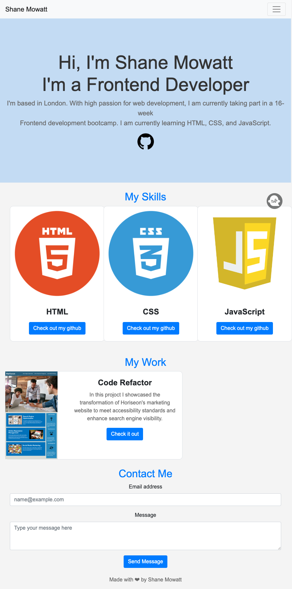

# Bootstrap-Portfolio

()

# About this project
In this project I demonstrate how I can use bootstrap to build a portfolio webpage and add css for styling.

# What I did on this project
In this project I used Bootstrap to create different sections to make up a portfolio webpage. I used CSS to style the webpage so it does not look like a standard Bootstrap webpage
